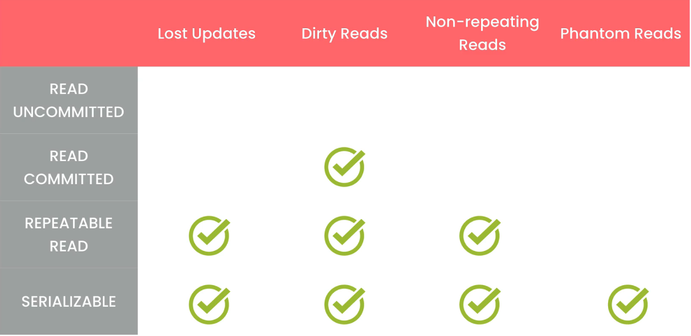

# Triggers

- A block of SQL code that automatically gets executed before or after an `INSERT`, `UPDATE`, or `DELETE` statement.
- We use them to enforce data consistency.
- Naming convention for a trigger:

  ```SQL
  tableName_{before/after}_SQLStatementType(insert/update/delete)
  ```

  ```SQL
  DELIMITER $$
  CREATE TRIGGER payments_after_insert
  AFTER INSERT ON payments
  FOR EACH ROW
  BEGIN
  UPDATE invoices
  SET payment_total = payment_total + NEW.amount
  WHERE invoice_id = NEW.invoice_id;
  END $$

  DELIMITER ;
  ```

- `NEW` returns the row that was just inserted.
- Use `OLD` instead of `NEW` when we `DELETE/UPDATE` a row and we need to access the old value.
- One common use case for triggers is logging changes to the data for auditing.

## Viewing Triggers

- View all the triggers in the current database.

  ```SQL
  SHOW TRIGGERS;
  SHOW TRIGGERS LIKE ‘payments%’
  ```

## Dropping Triggers

```SQL
DROP TRIGGER IF EXISTS name_of_the_trigger;
```

# Events

- An event is a task (or block of SQL code) that gets executed according to a schedule.
- We use events to **automate database maintenance tasks** such as
  - Deleting stale data
  - Copying data from one table into an archive table
  - Aggregate data to generate reports
- Before scheduling an event, we need to turn on MySQL event scheduler.

  - It is a process that runs in the background and it consistently looks for events to execute.
  - To turn on event scheduler in MySQL use

    ```SQL
    SET GLOBAL event_scheduler = ON
    ```

- To view all the system variables in MySQL, run

  ```SQL
  SHOW VARIABLES;
  SHOW VARIABLES LIKE ‘event%;
  SHOW VARIABLES LIKE ‘autocommit’;
  ```

- Creating an event

  ```SQL
  DELIMITER $$

  CREATE EVENT yearly_delete_stale_audit_rows
  ON SCHEDULE
    -- AT ‘2021-01-01’ (If the event should run only once at a specific time)
    EVERY 1 HOUR STARTS  ‘2021-01-01’ ENDS  ‘2021-12-31’
  DO BEGIN
    DELETE FROM payments_audit
    WHERE action_date < NOW() - INTERVAL 1 YEAR;
  END $$

  DELIMITER ;
  ```

## Viewing the events in the current database

```SQL
SHOW EVENTS;
```

## Dropping an event

```SQL
DROP EVENT IF EXISTS event_name
```

## Altering an Event

- The structure is exactly the same as the `CREATE EVENT`.
- We can also use `ALTER EVENT` statements to temporarily enable/disable an event.

  ```SQL
  ALTER EVENT event_name DISABLE/ENABLE;
  ```

# Transaction

- Transaction is a group of SQL statements that represent a single unit of work.
  - So, all these statements should be completed successfully, or the transaction will fail.
- These transactions have a few properties. We refer to these properties as **ACID**.
  - **Atomicity**
    - Either all the statements get executed successfully and the transaction is committed, or the transaction is rolled back and all the changes are undone.
  - **Consistency**
    - With these transactions our database will always remain in a consistent state.
  - **Isolation**
    - These transactions are isolated or protected from each other if they try to modify the same data. So, they cannot interfere with each other.
    - If multiple transactions try to update the same data, the rows that are being affected get locked, so only one transaction at a time can update those rows. Other transactions have to wait for that transaction to be complete.
  - **Durability**
    - Once a transaction is committed, the changes made by the transaction are permanent.
    - So, if you have a power failure or a system crash, we are not going to lose the changes.

## Creating Transaction

- To create a transaction, we use the `START TRANSACTION` statement.
- We close the transaction using the COMMIT statement.
- We write the group of SQL statements in between.
- If we want to discard the previous changes, we can use the `ROLLBACK` statement instead of the `COMMIT` statement.

  ```SQL
  START TRANSACTION

  INSERT INTO orders (customer_id, order_date, status)
  VALUES (1, ‘2019-01-01’, 1);

  INSERT INTO orders_items
  VALUES(LAST_INSERT_ID(), 1, 1, 1);

  COMMIT;
  ```

# Concurrency and Locking

- Concurrency occurs when multiple users try to access the same data at the same time.
- Concurrency can become a problem when one user modifies the data that other users are trying to retrieve or modify.
- So, if a transaction tries to modify a row or multiple rows, MySQL puts a lock on these rows.
  - This lock prevents other transactions from modifying these rows until the first transaction is done.

## Concurrency Problems

1. **Lost Updates**

- This happens when two transactions try to update the same data and we don’t use locks.
- In this situation, the transaction that commits later will overwrite the changes made by the previous transaction.
- **Solution**
  - Use locks to prevent this situation.

2. **Dirty Reads**

- A dirty read happens when a transaction reads uncommitted data.
- **Solution**
  - We need to provide a level of isolation around our transactions. So, data modified by a transaction is not immediately visible to other transactions unless it is committed.
  - Use `READ COMMITTED` isolation level for transaction and that transaction will only read committed data.

3. **Non-repeatable/inconsistent Reads**

- It happens when we read the same data twice in a transaction and get different results.
- **Solution**
  - Use `REPEATABLE READ`. With this level, our reads are repeatable and consistent, even if the data gets changed by other transactions
  - We’ll see the snapshot that was established by the first read.

4. **Phantom Reads**

- It happens when we miss one or more rows in our query. Because another transaction is changing the data and we are not aware of the changes in our transaction.
- **Solution**
  - Use `SERIALIZABLE`. This will guarantee that our transaction will be aware of changes currently being made by other transactions to the data.
  - If there are other transactions modifying the data that can impact our query result, our transaction has to wait for them to complete.
    - So, transactions will be executed sequentially.
    - This is the highest level of isolation that we can apply to our transactions and it gives us the most certainty in our operations.
    - But it comes with a cost. The more users and more concurrent transactions we have, the more waits we are going to experience and our system will slow down.
      - Because this needs extra resources in terms of memory and CPU to manage the transactions that have to wait. This puts an overhead on the server.
    - So, this isolation level can hurt performance and scalability.
    - For this reason, we should reserve this only in scenarios where it is absolutely necessary to prevent phantom reads.

## Transaction Isolation Levels

- The standard SQL defines 4 transaction isolation levels:

  1. **`READ UNCOMMITTED`**

     - This is the lowest isolation level and with this we can experience all concurrency problems.

  2. **`READ COMMITTED`**

     - **Pros**. It solves the dirty reads problem.
     - **Cons**. It has non-repeatable reads.

  3. **`REPEATABLE READ`**

     - It is the default isolation level in MySQL.
     - **Cons**. Phantom Reads

  4. **`SERIALIZABLE`**

     - It provides the highest isolation level and solves all concurrency problems.
     - At this level our transactions are executed sequentially.
       - So, we really don’t have concurrency.

- In MySQL the default isolation level is `REPEATABLE READ`.



### Viewing current isolation level

```SQL
SHOW VARIABLES LIKE ‘transaction_isolation’
```

### Changing transaction Isolation Level

- Sets the isolation level only for the next transaction

  ```SQL
  SET TRANSACTION ISOLATION LEVEL SERIALIZABLE;
  ```

- Set transaction Isolation Level for all future transactions in the current session
  ```SQL
  SET SESSION TRANSACTION ISOLATION LEVEL SERIALIZABLE;
  ```
- Set transaction Isolation Level for all future transactions globally (for all session)
  ```SQL
  SET GLOBAL TRANSACTION ISOLATION LEVEL READ COMMITTED;
  ```

# Deadlock

- A deadlock happens when different transactions cannot complete because each transaction holds a lock that the other needs.
- So, both transactions keep waiting for each other and never release their locks.
- If MySQL finds a deadlock, it rolls back the transactions.
- Unless deadlocks happen very frequently, it is not a really big issue.
  - In our application we should write code to reissue a transaction if it gets rolled back because of a deadlock.
  - Or, we should let the user know that this operation failed and ask them to retry.
- We can never completely get rid of deadlock, we can just minimize the likelihood.
  Steps to minimize deadlock
  - If you frequently detect deadlocks in two transactions, look at their code. These transactions could be part of two stored procedures. Now, look at the order of the statements in those transactions. If these transactions update records in the reverse order, it's likely we are going to have a deadlock. So, to reduce deadlock we can follow the same order when updating multiple records.
  - Keep your transactions small and short in duration, so they are not likely to collide with other transactions. If you have transactions that operate on really large tables, these transactions may take a long time to run. And then you are at risk for collision. If that is the case, try to schedule those transactions to run during non peak hours.
