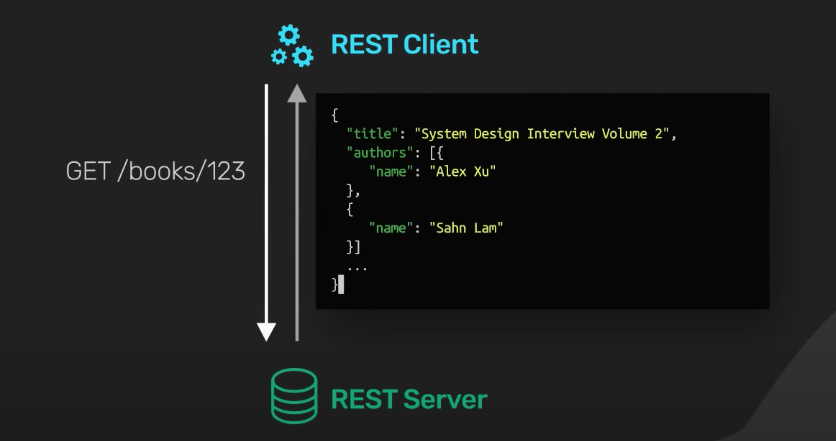
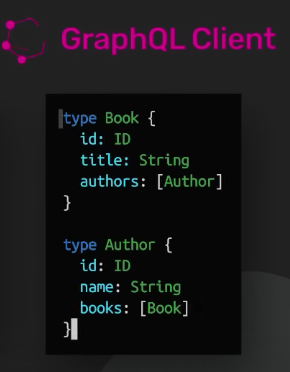
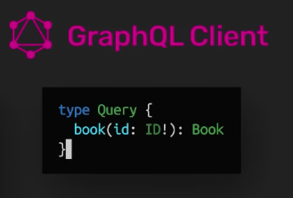
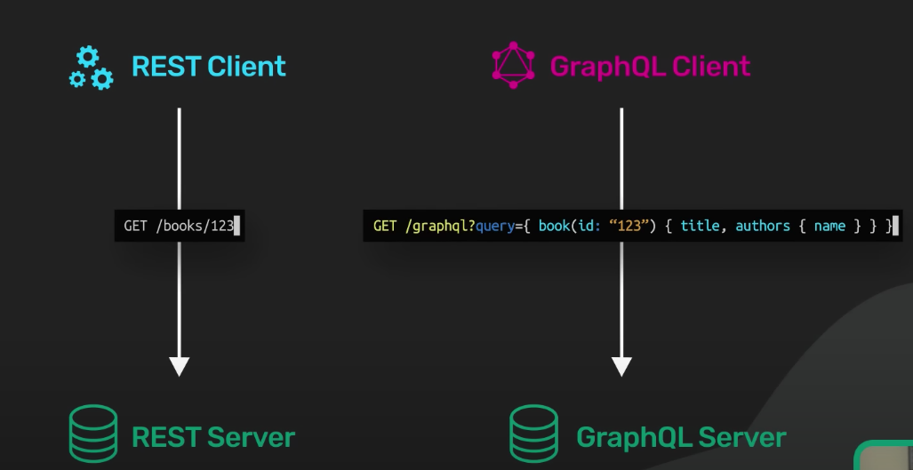
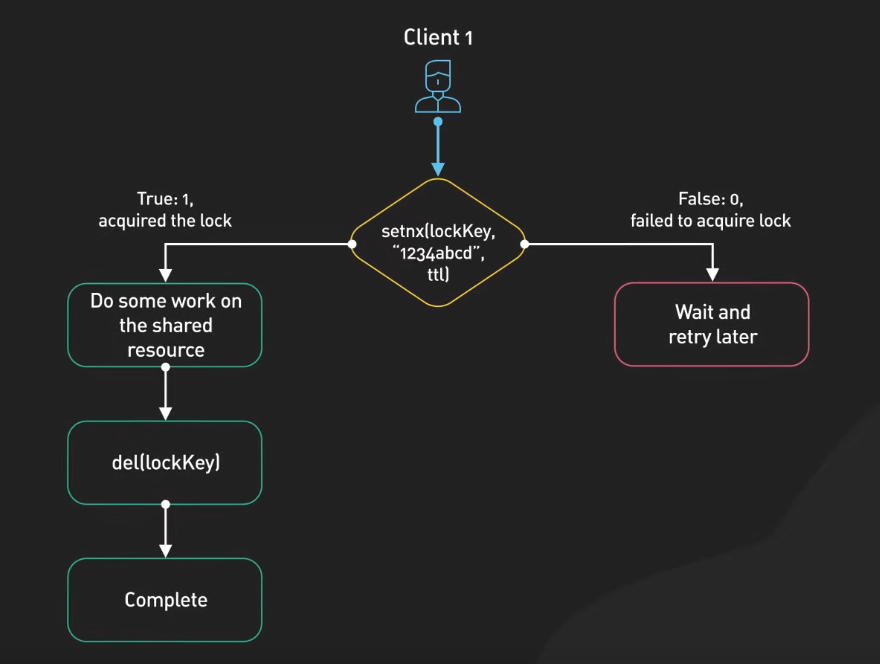
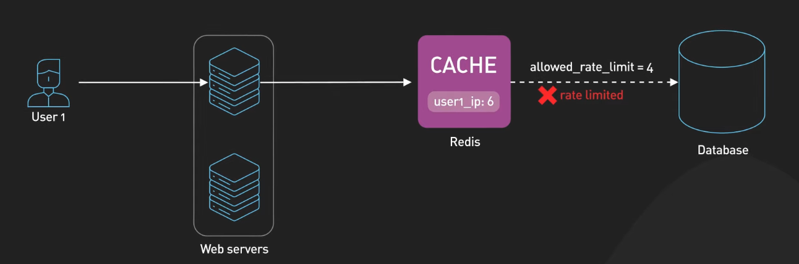
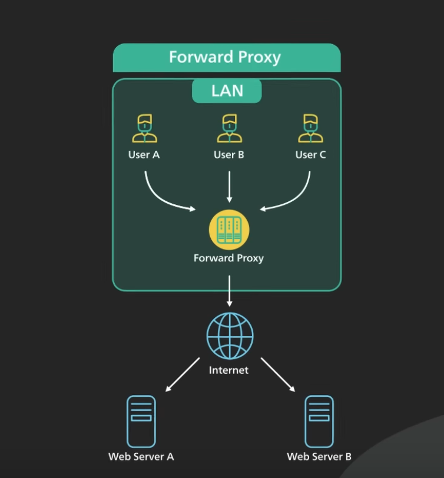
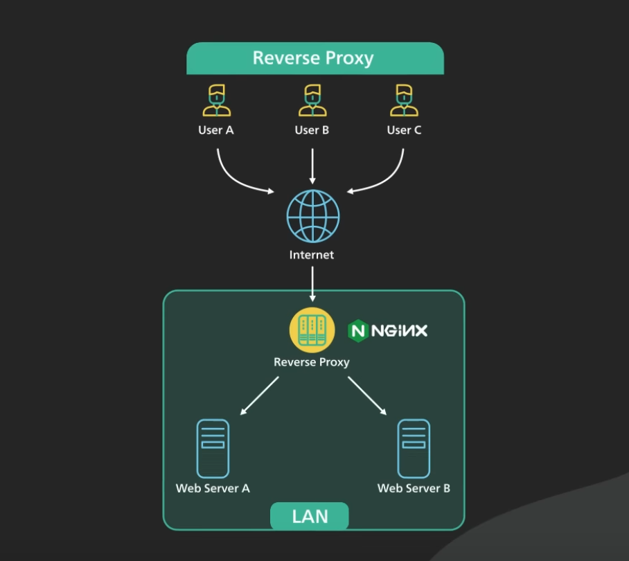

# HTTP vs HTTPS

- Without HTTPS the communication between the browser and the server is in plain text. This means that the password you enter or the credit card number you send over the internet can be read by anyone who has the ability to intercept it.
- HTTPS is designed to solve this problem to make the data sent over the Internet unreadable by anyone other than the sender and the receiver.

## HTTPS

- HTTPS is an extension of the HTTP protocol.
- With HTTPS data is sending an encrypted form using something called TLS.- TLS stands for transport layer security. If the encrypted data gets intercepted by a hacker all they could see is jumbled data.
- Let's take a look at how the TLs handshake works. There are several steps
  1. **TCP Handshake:** Just like in the case for HTTP the browser establishes a TCP connection with the server.
  2. **Certificate Check** This is where the TLs handshake begins the process sends a "Client Hello"" to the server.
     - In this Hello message the browser tells the server the following things:
       - What TLS version it can support. It could be TLS 1.2 TLS 1.3 etc.
       - What cyber Suite it supports. A cyber Suite is a set of encryption algorithms to use to encrypt data.
     - After receiving the "Client Hello" the server gets to choose the Cyber suite and the TLs version to use based on the options it got from the client. It sends those in the "Server Hellow" message back to the client.
     - The server then sends the certificate to the client. The certificate includes a lot of different things. One of the key things is the public key for the server. The client uses the public key in something called asymmetric encryption. In asymmetric encryption a piece of data that is encrypted by a public key can only be decrypted by the private key.
     - this concludes step two - "the Hellow Phase" of the TLs handshake. At this point the client has a service certificate and the client and server have agreed on the TLS version and the Cyber Suite to use.
  3. **Key Exchange:** In this step the client and the server come up with a shared encryption key to use to encrypt data.
     - With asymmetric encryption the data encrypted on the client side using the public key from the server can only be decrypted by the server. This is how the client sends an encryption key safely to the server over the wide open internet. All this is done in the "client key exchange" message. The exact detail varies depending on the Cyber Suite used.

# Process vs Thread

## Process

- A program is an executable file. It contains the code, or a set of processor instructions, that is stored as a file on disk.
- When the code in a program is loaded into memory and executed by the processor, it becomes a process.
- An active process also includes the resources the program needs to run (i.e. CPU, RAM, I/O). These resources are managed by the operating system.
- Some examples of processes are
  - processor registers
  - program counters
  - stack pointers
  - memory pages assigned to the process for its heap and stack, etc.
- Each process has its own memory address space. One process cannot corrupt the memory space of another process. This means that when one process malfunctions, other processes keep running.
  - Chrome is famous for taking advantage of this process isolation by running each tab in its own process. When one tab misbehaves due to a bug or a malicious attack, other tabs are unaffected.

## Thread

- A thread is the unit of execution within a process.
- A process has at least one thread. It is called the main thread. It is not uncommon for a process to have many threads.
- Each thread has its own stack. Earlier we mentioned registers, program counters, and stack pointers as being part of a process. It is more accurate to say that those things belong to a thread.
- Threads within a process share a memory address space. It is possible to communicate between threads using that shared memory space.
- However, one misbehaving thread could bring down the entire process.

## How does the operating system run a thread or process on a CPU?

- This is handled by context switching.
- During a context switch, one process is switched out of the CPU so another process can run.
- The operating system stores the states of the current running process so the process can be restored and resume execution at a later point.
- It then restores the previously saved states of a different process and resumes execution for that process.
- Context switching is expensive. It involves saving and loading of registers, switching out memory pages, and updating various kernel data structures.
- Switching execution between threads also requires context switching. It is generally faster to switch context between threads than between processes.
- There are fewer states to track, and more importantly, since threads share the same memory address space, there is no need to switch out virtual memory pages, which is one of the most expensive operations during a context switch.
- Context switching is so costly there are other mechanisms to try to minimize it. Some examples are fibers and coroutines.
- These mechanisms trade complexity for even lower context-switching costs. In general, they are cooperatively scheduled, that is, they must yield control for others to run.
- In other words, the application itself handles task scheduling. It is the responsibility of the application to make sure a long-running task is broken up by yielding periodically.

# Microservice

- Microservices architecture enables large teams to build scalable applications that are composed of many loosely coupled services.
- Microservices are loosely coupled. Each service handles a dedicated function inside a large-scale application. For example, shopping cart, billing, user profile, push notifications can all be individual microservices. These functional areas are sometimes called domains.
- Microservices communicate with each other via well-defined interfaces with small surface areas. The small surface areas limit the blast radius of failures and defects. It makes each service easier to reason about in the context of the entire application.
- Microservices talk to one another over a combination of remote procedure calls (RPC), event streaming, or message brokers.
- RPC like gRPC provides faster response, but the blast radius, or the impact to other microservices, would be larger when the service was to go down. Event streaming provides better isolation between services but they take longer to process.
- Microservices can be independently deployed. Since each service is small, easier to reason about, and has a smaller blast radius, this gives the operators peace of mind and confidence to deploy often.
- Microservices provide more flexibility to scale up individual microservices independently. The operational flexibility is invaluable.
- Well-architected microservices practice strong information hiding. This often means breaking up a monolithic database into its logical components and keeping each logical component well hidden inside its corresponding microservice. By logical component, it could mean a separate schema within a database cluster or an entirely separate physical database.
- However, one big drawback of microservices is the breaking up of the database. By breaking up a database into separate logical units, the database can no longer maintain foreign key relationships and enforce referential integrity between these units. The burden of maintaining data integrity is now moved into the application layer.
- A key component required for a successful implementation of microservices architecture is an API gateway.
- The API gateway relies on an identity provider service to handle the authentication and put authorization of each request coming through the API gateway. To locate the service to route an incoming request to, the API gateway consults a service registry and discovery service. Microservices register with this service registry and discover the location of other microservices through the discovery service.
- There are other useful components in a microservices architecture like monitoring and alerting, DevOps toolings for deployment, and troubleshooting, for example.

## When to use microservices architecture

- Microservices cost money to build and operate. It really only makes sense for large teams. For large teams, it enables team independence. Each domain, or function, can be independently maintained by a dedicated team.
- In a well-designed microservices architecture, these independent teams can move fast, and the blast radius of failures is well-contained. Each service could be independently designed, deployed, and scaled. However, the overhead of a sound implementation is so large that it is usually not a good fit for small startups.
- One advice for startups is to design each function in the application with a well-defined interface. One day if the business and team are growing fast that microservices architecture starts to make sense, it would be more manageable to migrate.

# GraphQL

- GraphQL is a query language for API developed by Meta.
- It provides a schema of the data in the API and gives clients the power to ask for exactly what they need.
- GraphQL sits between the clients and the backend services.
- It could aggregate multiple resource requests into a single query.
- It also supports mutations, and subscriptions.
  - Mutations are GraphQL’s way of applying data modifications to resources.
  - Subscriptions are GraphQL’s way for clients to receive notifications on data modifications.

## GraphQL vs REST

- In practice, both GraphQL and REST send HTTP requests and receive HTTP responses.
- REST centers around resources. Each resource is identified by a URL.
- To fetch a book from a bookstore API, it could look something like this.
  
- Note that the authors field is implementation specific. Some REST API implementations might break them out into separate REST calls.
- With GraphQL, this looks different.
- We first define the types.
  
- In this example, we have the Book and Author types.
- These types describe the kinds of data available.
- They don’t specify how the data is retrieved via GraphQL.
- To do that, we need to define a Query, like this.
  
- Now we can send a request to the GraphQL endpoint to fetch the same data.
  

### Similarities

- REST and GraphQL both use HTTP.
- Both make a request via a URL, and both can return a JSON response in the same shape.

### Differences

- With GraphQL, we specify the exact resources we want, and also which fields we want.

  ```Javascript
  GET /graphql?query={ book(id: '123') { title, authors { name } } }
  ```

- In the case of REST, the API implementer decided for us that authors are included as related resources. With GraphQL, the client decides what to include.

## Advantage of GraphQL

- This brings up one of the main benefits of GraphQL.
  - GraphQL doesn’t use URLs to specify the resources that are available in the API. Instead, it uses a GraphQL schema.
  - We can send a complex query that fetches additional data according to relationships defined in the schema.
  - Doing the same in REST is more complicated. We would have to do that client side with multiple requests. This is a common problem resulting in N+1 queries.

## Drawbacks of GraphQL

- The beauty of REST is that we don’t need special libraries to consume someone else’s API. Requests can simply be sent using common tools like cURL or simply a web browser.
  - In contrast, GraphQL requires heavier tooling support, both on the client and server sides. This requires a sizable upfront investment. This upfront cost might not be worth it, especially for very simple CRUD APIs.
- Another criticism of GraphQL is that it is more difficult to cache.
  - REST uses HTTP GET for fetching resources, and HTTP GET has a well-defined caching behavior that is leveraged by browsers, CDNs, proxies, and web servers.
  - GraphQL has a single point of entry and uses HTTP POST by default.
    This prevents the full use of HTTP caching. With care, GraphQL could be configured to better leverage HTTP caching.
  - The detail is very nuanced. But, it is important to understand that it is extra work, and getting it right is not trivial.
- The final concern we have with GraphQL is that while GraphQL allows clients to query for just the data they need, this also poses a great danger.
  - Imagine this example where a mobile application shipped a new feature that causes an unexpected table scan of a critical database table of a backend service. This could bring the database down as soon as the new application goes live. Yes, there are ways to mitigate this risk, but it adds even more complexity to a GraphQL implementation. The cost to safeguard risks like this must be factored in when considering GraphQL.

# Consistent Hashing

In a large scale distributed system, data does not fit on a single server. They are distributed across many machines. This is called horizontal scaling. To build such a system with predictable performance. it is important to distribute the data evenly across those servers. A common method to distribute data as evenly as possible among servers is simple hashing.

## How Simple Hashing Works?

- First, for each object, we hash its key with a hashing function like MD5 or MurmurHash.
  - This maps the object key to a known range of numerical values. A good hashing function distributes the hashes evenly across the entire range.
- Second, we perform the modulo operation on the hash against the number of servers. This determines which servers the object belongs to.
  - As long as the number of servers stays the same, an object key will always map to the same server.
- This approach works well when the size of the cluster is fixed, and the data distribution is even.
- But what happens when new servers get added to meet new demand or when existing servers get removed?
- If 1 server goes down, even though the hashes for the object keys stay the same, we are now applying the modulo operation to a different set of n.
- **The impact is pretty drastic. Most of the keys get redistributed. This affects almost all objects, it's not just the objects originally stored in the server that is now offline. This triggers a storm of misses and lots of objects to be moved. For situations where servers constantly come and go, this design is untenable.**

## When to use consistent hashing?

- The goal of consistent hashing is to make sure almost all objects to stay assigned to the same server even as the number of servers changes.
- Here is the core insight of consistent hashing.
  - In addition to hashing the object keys like before, we also hash the server names. The objects and servers are hashed with the same hashing function to the same range of values.
  - In our example we have a range of x0 to xn. This range is called a hash space. Next, we connect both ends of the hash space to form a ring called hash ring. Using a hashing function we hash each server by its name or ip address, and place the server onto the ring.
  - Using a hashing function we hash each server by its name or ip address, and place the server onto the ring.
  - Next, we hash each object by its key with the same hashing function. Unlike simple hashing where we perform a modulo operation on the hash, here we use the hash directly to map the object key onto the ring.
  - To locate the server for a particular object, we go clockwise from the location of the object key on the ring until a server is found.

## Design issue with Consistent Hashing

The distribution of the objects in the servers on the ring is likely to be uneven. Conceptually, we pick n random points on the ring, we are very unlikely to get a perfect partition of the ring into equally sized segments.

## Simple vs Consistent Hashing

- With simple hashing, when a new server is added almost all the keys need to be remapped. With consistent hashing, adding a new server only requires redistribution of a fraction of the keys.

# Database

## Geospatial Database

- There is a class of databases called geospatial databases that is optimized for storing and querying data in geometric space like location data.
- Some examples of these databases are Redis GEOHASH and Postgres with PostGIS extension.

# Cache

A cache is a **temporary storage area** that stores the result of expensive responses or frequently accessed data in memory so that subsequent requests are served more quickly.

## Why do we want to use cache?

- Cache is much faster than database.
- It improves the system performance.
- It reduces database workloads.
- We can scale the cache tier independently.

## Cache Best Practices

- Consider using cache when data is read frequently but modified infrequently.
  - Cached data is stored in volatile memory. Important data should be saved in persistent data stores.
- Implement an expiration policy.
- Keep the data store and the cache in sync to maintain data consistency. Inconsistency can happen because data-modifying operations on the data store and cache are not in a single transaction.
- Multiple cache servers across different data centers are recommended to avoid single point of failure.
- Implement an eviction policy.

## Redis

- Redis is an in-memory data structure store.
- It is most commonly used as a cache.
- It supports many data structures, such as strings, hashes, lists, sets, and sorted sets.
- Redis is known for its speed.

## Top Use Cases of Redis

1. The number one use case for Redis is caching objects to speed up web applications.

   - In this use case, Redis stores frequently requested data in memory.
   - It allows the web servers to return frequently accessed data quickly.
   - This reduces the load on the database and improves the response time for the application.
   - At scale, the cache is distributed among a cluster of Redis servers.
   - Sharding is a common technique to distribute the caching load evenly across the cluster.
   - Other topics to consider when deploying Redis as a distributed cache include setting a correct TTL and handling a thundering herd on cold start.

2. Another common use case is to use Redis as a session store to share session data among stateless servers.
   - When a user logs in to a web application, the session data is stored in Redis, along with a unique session ID that is returned to the client as a cookie.
   - When the user makes a request to the application, the session ID is included in the request, and the stateless web server retrieves the session data from Redis using the ID.
   - It's important to note that Redis is an in-memory database. The session data stored in Redis will be lost if the Redis server restarts.
   - Even though Redis provides persistence options like snapshots and AOF, or Append-Only File, that allow session data to be saved to disk and reloaded into memory in the event of a restart, these options often take too long to load on restart to be practical.
   - In production, replication is usually used instead. In this case, data is replicated to a backup instance. In the event of a crash of the main instance, the backup is quickly promoted to take over the traffic.
3. Next use case is distributed lock. Distributed locks are used when multiple nodes in an application need to coordinate access to some shared resource.

   - Redis is used as a distributed lock with its atomic commands like `SETNX`, or `SET if Not eXists`. It allows a caller to set a key only if it does not already exist.
   - Here’s how it works at a high level: - Client 1 tries to acquire the lock by setting a key with a unique  
      value and a timeout using the `SETNX` command: `SETNX lock "1234abcd"` - If the key was not already set, the `SETNX` command returns 1, indicating that the lock has been acquired by Client 1. - Client 1 finishes its work and releases the lock by deleting the key. - If the key was already set, the `SETNX` command returns 0,  
      indicating that the lock is already held by another client. - In this case, Client 1 waits and retries the `SETNX` operation until the lock is released by the other client. - Note that this simple implementation might be good enough for many use cases, but it is not completely fault tolerant. For production use, there are many Redis client libraries that provide high quality distributed lock implementation built out of the box.

     

4. Redis can be used as a rate limiter by using its increment command on some counters and setting expiration times on those counters.

   - A very basic rate-limiting algorithm works this way:

     - For each incoming request, the request IP or user ID is used as a key.
     - The number of requests for the key is incremented using the INCR command in Redis.
     - The current count is compared to the allowed rate limit.
     - If the count is within the rate limit, the request is processed.
     - If the count is over the rate limit, the request is rejected.
     - The keys are set to expire after a specific time window, e.g., a minute, to reset the counts for the next time window.
     - More sophisticated rate limiters like the leaky bucket algorithm can also be implemented using Redis.

     

5. The last use case we would like to talk about is gaming leaderboard.
   - For most games that are not super high scale, Redis is a delightful way to implement various types of gaming leaderboards.
   - Sorted Sets are the fundamental data structure that enables this.
   - A Sorted Set is a collection of unique elements, each with a score associated with it. The elements are sorted by score.
   - This allows for quick retrieval of the elements by score in logarithmic time.

# Content delivery network (CDN)

- A CDN is a network of geographically dispersed **servers used to deliver static content**.
- CDN servers cache static content like images, videos, CSS, JavaScript files, etc.

# Forward Proxy vs Reverse Proxy

Two common types of proxy are forward proxy and reverse proxy.

## Forward Proxy

- A forward proxy sits **between the client and the internet** and acts on behalf of the client.
- A forward proxy is a server that sits between a group of client machines and the internet. When those clients make requests to websites on the internet, the forward proxy acts as a middleman and intercepts those requests and talks to web servers on behalf of those client machines.



### Why would anyone want to use forward proxy?

1. A forward proxy **protects the client’s online identity**. By using a forward proxy to connect to a website, the IP address of the client is hidden from the server. Only the IP address of the proxy is visible. It would be harder to trace back to the client.
2. A forward proxy can be used to **bypass browsing restrictions**. Some institutions like governments, schools, and big businesses use firewalls to restrict access to the internet. By connecting to a forward proxy outside the firewalls, the client machine can potentially get around these restrictions. It does not always work because the firewalls themselves could block the connections to the proxy.
3. A forward proxy can be used to **block access to certain content**. This is not uncommon for schools and businesses to configure their networks to connect all clients to the web through a proxy and apply filtering rules to disallow sites like social networks.

## Reverse Proxy

A reverse proxy sits between **the internet and the web servers**. It intercepts the requests from clients and talks to the web server on behalf of the clients.



### Why would a website use a reverse proxy?

1. A reverse proxy could be used to **protect a website**. The website’s IP addresses are hidden behind the reverse proxy and are not revealed to the clients. This makes it much harder to target a **DDoS attack** against a website.
2. A reverse proxy is used for **load balancing**. A popular website handling millions of users every day is unlikely to be able to handle the traffic with a single server. A reverse proxy can balance a large amount of incoming requests by distributing the traffic to a large pool of web servers, and effectively preventing any single one of them from becoming overloaded.

   - Note that this assumes that the reverse proxy can handle the incoming traffic. Services like Cloudflare put reverse proxy servers in hundreds of locations all around the world. This puts the reverse proxy close to the users and at the same time provides a large amount of processing capacity.

3. A reverse proxy **caches static content**. A piece of content could be cached on the reverse proxy for a period of time. If the same piece of content is requested again from the reverse proxy, the locally cached version could be quickly returned.
4. A reverse proxy can **handle SSL encryption**. SSL handshake is computationally expensive. A reverse proxy can free up the origin servers from these expensive operations. Instead of handling SSL for all clients, a website only needs to handle SSL handshake from a small number of reverse proxies.

### Uses of Reverse Proxy

Reverse proxies are everywhere. For a modern website, it is not uncommon to have many layers of reverse proxy.

- The first layer could be an **edge service like Cloudflare**. The reverse proxies are deployed to hundreds of locations worldwide close to the users.
- The second layer could be an **API gateway or load balancer at the hosting provider**. Many cloud providers combine these two layers into a single ingress service. The user would enter the cloud network at the edge close to the user, and from the edge, the reverse proxy connects over a fast fiber network to the load balancer where the request is evenly distributed over a cluster of web servers.

### References

- [Proxy vs Reverse Proxy](https://www.youtube.com/watch?v=4NB0NDtOwIQ)

# API Gateway

- An API gateway is a **single point of entry** to the clients of an application.
- It sits between the clients and a collection of backend services for the application.
- An API gateway typically provides several important functions. Some common ones are:
  - authentication and security policy enforcements
  - load balancing and circuit breaking,
  - protocol translation and service discovery,
  - monitoring, logging, analytics, and billing.
  - Caching.

### Typical flow of a client request through the API gateway and onto the backend service.

1. Step 1 - the client sends a request to the API gateway. The request is typically HTTP-based. It could be REST, GraphQL, or some other higher-level abstractions.
2. Step 2 - the API gateway validates the HTTP request.
3. Step 3 - the API gateway checks the caller’s IP address and other HTTP headers against its allow-list and deny-list. It could also perform basic rate limit checks against attributes such as IP address and HTTP headers. For example, it could reject requests from an IP address exceeding a certain rate.
4. Step 4 - the API gateway passes the request to an identity provider for authentication and authorization. The API gateway receives an authenticated session back from the provider with the scope of what the request is allowed to do.
5. Step 5 - a higher level rate-limit check is applied against the authenticated session. If it is over the limit, the request is rejected at this point.
6. Step 6 and 7 - With the help of a service discovery component, the API gateway locates the appropriate backend service to handle the request by path matching.
7. Step 8 - the API gateway transforms the request into the appropriate protocol and sends the transformed request to the backend service. An example would be gRPC.

When the response comes back from the backend service, the API gateway transforms the response back to the public-facing protocol and returns the response to the client.

- A proper API gateway also provides other critical services.
  - For example, an API gateway should track errors and provide circuit-breaking functionality to protect the services from overloading.
- An API gateway should also provide logging, monitoring, and analytics services for operational observability.
- An API gateway is a critical piece of the infrastructure. It should be deployed to multiple regions to improve availability. For many cloud provider offerings, the API gateway is deployed across the world close to the clients.

# Documention

- [What happens when you type a URL into your browser?](https://blog.bytebytego.com/p/what-happens-when-you-type-a-url)
- [Everything You Always Wanted to Know About TCP But Too Afraid to Ask](https://blog.bytebytego.com/p/everything-you-always-wanted-to-know)
- [The Foundation of REST API: HTTP](https://blog.bytebytego.com/p/the-foundation-of-rest-api-http)
- [HTTP and Statelessness](https://medium.com/@jaimietn/http-and-statelessness-5e290fec80c0)
- [HTTP 1.0 -> HTTP 1.1 -> HTTP 2.0 -> HTTP 3.0 (QUIC)](https://blog.bytebytego.com/p/http-10-http-11-http-20-http-30-quic)
- [Explaining 8 Popular Network Protocols in 1 Diagram](https://blog.bytebytego.com/i/137744340/explaining-popular-network-protocols-in-diagram)
- [Network Protocols Run the Internet](https://blog.bytebytego.com/p/network-protocols-run-the-internet)
- [A Crash Course in DNS (Domain Name System)](https://blog.bytebytego.com/p/a-crash-course-in-dns-domain-name?utm_source=profile&utm_medium=reader2)
- [How does the Domain Name System (DNS) lookup work?](https://blog.bytebytego.com/p/how-does-the-domain-name-system-dns)
- [HTTPS, SSL Handshake, and Data Encryption Explained to Kids](https://blog.bytebytego.com/i/136212400/https-ssl-handshake-and-data-encryption-explained-to-kids)
- [Is HTTPs safe?](https://blog.bytebytego.com/i/70478435/is-https-safe)
- [TCP vs. UDP: 7 Differences You Should Know](https://blog.bytebytego.com/i/113419155/tcp-vs-udp-differences-you-should-know)
- [URL, URI, URN - Do you know the differences?](https://blog.bytebytego.com/i/132279282/url-uri-urn-do-you-know-the-differences)

## Database

- [How is a SQL statement executed in the database?](https://blog.bytebytego.com/i/69544276/how-is-a-sql-statement-executed-in-the-database)
- [Database Indexing Strategies](https://blog.bytebytego.com/p/database-indexing-strategies?utm_source=profile&utm_medium=reader2)
- [Database Indexing Strategies - Part 2](https://blog.bytebytego.com/p/database-indexing-strategies-part?utm_source=profile&utm_medium=reader2)
- [A nice cheat sheet of different databases in cloud services](https://blog.bytebytego.com/i/136212400/a-nice-cheat-sheet-of-different-databases-in-cloud-services)
- [Which database shall I use?](https://blog.bytebytego.com/p/which-database-shall-i-use)
- [How do you decide which type of database to use?](https://blog.bytebytego.com/i/89821739/how-do-you-decide-which-type-of-database-to-use)
- [How to choose the right database](https://blog.bytebytego.com/i/72593300/how-to-choose-the-right-database)
- [Understanding Database Types](https://blog.bytebytego.com/p/understanding-database-types)
- [Factors to Consider in Database Selection](https://blog.bytebytego.com/p/factors-to-consider-in-database-selection)
- [Key Steps in the Database Selection Process](https://blog.bytebytego.com/p/key-steps-in-the-database-selection)
- [Vertical partitioning vs horizontal partitioning](https://blog.bytebytego.com/p/vertical-partitioning-vs-horizontal)

### Data Replication

- [Data Replication: A Key Component for Building Large-Scale Distributed Systems](https://blog.bytebytego.com/p/data-replication-a-key-component?utm_source=profile&utm_medium=reader2)
- [How to Choose a Replication Strategy](https://blog.bytebytego.com/p/how-to-choose-a-replication-strategy?utm_source=profile&utm_medium=reader2)
- [Read replica pattern](https://blog.bytebytego.com/p/read-replica-pattern)
- [How to implement read replica pattern](https://blog.bytebytego.com/p/how-to-implement-read-replica-pattern)
- [Latency and consistency tradeoffs for data replication](https://blog.bytebytego.com/p/latency-and-consistency-tradeoffs)

## Caching

- [A Crash Course in Caching - Part 1](https://blog.bytebytego.com/p/a-crash-course-in-caching-part-1)
- [A Crash Course in Caching - Part 2](https://blog.bytebytego.com/p/a-crash-course-in-caching-part-2)
- [A Crash Course in Caching - Final Part](https://blog.bytebytego.com/p/a-crash-course-in-caching-final-part)
- [A Crash Course in Redis](https://blog.bytebytego.com/p/a-crash-course-in-redis?utm_source=profile&utm_medium=reader2)
- [The 6 Most Impactful Ways Redis is Used in Production Systems](https://blog.bytebytego.com/p/the-6-most-impactful-ways-redis-is?utm_source=profile&utm_medium=reader2)
- [Redis Can Do More Than Caching](https://blog.bytebytego.com/p/redis-can-do-more-than-caching?utm_source=profile&utm_medium=reader2)
- [Why is redis so fast?](https://blog.bytebytego.com/p/why-is-redis-so-fast)
- [Top caching strategies](https://blog.bytebytego.com/p/top-caching-strategies)
- [Where do we cache data?](https://blog.bytebytego.com/i/92688517/where-do-we-cache-data)
- [Redis vs Memcached](https://blog.bytebytego.com/p/redis-vs-memcached)

## Message Queue

- [Why Do We Need a Message Queue?](https://blog.bytebytego.com/p/why-do-we-need-a-message-queue?utm_source=profile&utm_medium=reader2)
- [How to Choose a Message Queue? Kafka vs. RabbitMQ](https://blog.bytebytego.com/p/how-to-choose-a-message-queue-kafka?utm_source=profile&utm_medium=reader2)
- [Why is Kafka so fast? How does it work?](https://blog.bytebytego.com/p/why-is-kafka-so-fast-how-does-it?utm_source=profile&utm_medium=reader2)

## API Design

- [What is an API](https://blog.bytebytego.com/i/69544276/what-is-an-api)
- [How to design a secure web API access for your website?](https://blog.bytebytego.com/p/how-to-design-a-secture-web-api-access)
- [How do we design effective and safe APIs?](https://blog.bytebytego.com/i/111973267/how-do-we-design-effective-and-safe-apis)
- [Design Effective and Secure REST APIs](https://blog.bytebytego.com/p/design-effective-and-secure-rest)
- [Mastering the Art of API Design](https://blog.bytebytego.com/p/api-design)
- [How to improve API performance](https://blog.bytebytego.com/i/128938667/how-to-improve-api-performance)
- [Why is RESTful API so popular?](https://blog.bytebytego.com/p/why-is-restful-api-so-popular)
- [How does REST API work?](https://blog.bytebytego.com/i/89821739/how-does-rest-api-work)
- [SOAP vs REST vs GraphQL vs RPC](https://blog.bytebytego.com/p/soap-vs-rest-vs-graphql-vs-rpc)
- [What does API gateway do?](https://blog.bytebytego.com/i/72593300/what-does-api-gateway-do)
- [What is GraphQL? Is it a replacement for the REST API?](https://blog.bytebytego.com/i/72593300/what-is-graphql-is-it-a-replacement-for-the-rest-api)
- [What Is GraphQL? REST vs. GraphQL](https://blog.bytebytego.com/i/84137023/what-is-graphql-rest-vs-graphql)

## Scaling

- [How to scale a website to support millions of users?](https://blog.bytebytego.com/p/how-to-scale-a-website-to-support)
- [From 0 to Millions: A Guide to Scaling Your App - Part 1](https://blog.bytebytego.com/p/from-0-to-millions-a-guide-to-scaling)
- [From 0 to Millions: A Guide to Scaling Your App - Part 2](https://blog.bytebytego.com/p/from-0-to-millions-a-guide-to-scaling-7b4)
- [From 0 to Millions: A Guide to Scaling Your App - Part 3](https://blog.bytebytego.com/p/from-0-to-millions-a-guide-to-scaling-b53)
- [From 0 to Millions: A Guide to Scaling Your App - Part 4](https://blog.bytebytego.com/p/from-0-to-millions-a-guide-to-scaling-47a)

## Misc

- [Explaining JSON Web Token (JWT) to a 10 year old Kid](https://blog.bytebytego.com/i/135350048/explaining-json-web-token-jwt-to-a-year-old-kid)
- [Password, Session, Cookie, Token, JWT, SSO, OAuth - Authentication Explained - Part 1](https://blog.bytebytego.com/p/password-session-cookie-token-jwt)
- [Password, Session, Cookie, Token, JWT, SSO, OAuth - Authentication Explained - Part 2](https://blog.bytebytego.com/p/password-session-cookie-token-jwt-ec1)
- [Sessions, Tokens, JWT, SSO, and OAuth in One Diagram](https://blog.bytebytego.com/i/137535415/explaining-sessions-tokens-jwt-sso-and-oauth-in-one-diagram)
- [Oauth 2.0 Explained With Simple Terms](https://blog.bytebytego.com/i/135955829/oauth-explained-with-simple-terms)
- [Batch v.s. Stream Processing](https://blog.bytebytego.com/i/113419155/batch-vs-stream-processing)
- [Storage systems overview](https://blog.bytebytego.com/p/storage-systems-overview)
- [How to upload a large file to S3?](https://blog.bytebytego.com/p/how-to-upload-a-large-file-to-s3)
- [CDN](https://blog.bytebytego.com/i/75883385/cdn)
- [How does CDN work?](https://blog.bytebytego.com/p/how-does-cdn-work)
- [What is SSO](https://blog.bytebytego.com/p/what-is-sso-episode-7)
- [CAP theorem: one of the most misunderstood terms](https://blog.bytebytego.com/i/75883385/cap-theorem-one-of-the-most-misunderstood-terms)
- [Why is Nginx called a “reverse” proxy?](https://blog.bytebytego.com/i/75883385/why-is-nginx-called-a-reverse-proxy)
- [Rate Limiting Fundamentals](https://blog.bytebytego.com/p/rate-limiting-fundamentals)
- [Rate Limiter For The Real World](https://blog.bytebytego.com/p/rate-limiter-for-the-real-world)
- [What is a webhook?](https://blog.bytebytego.com/i/130740815/what-is-a-webhook)
